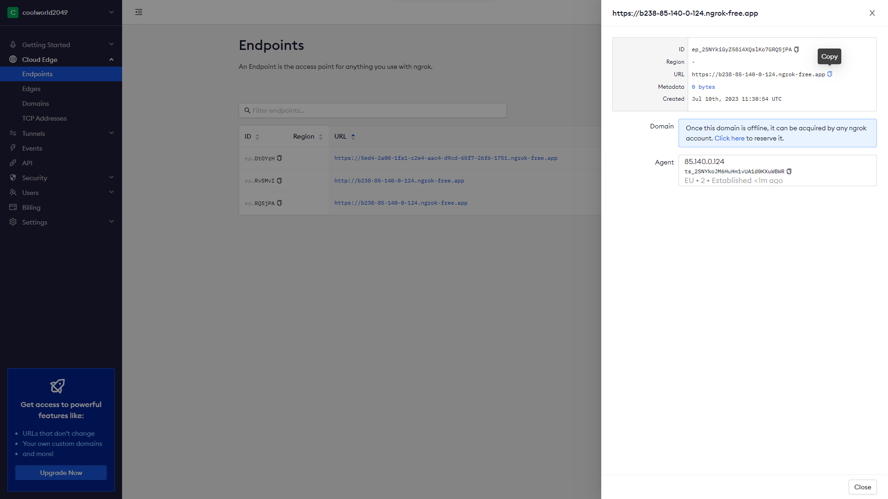
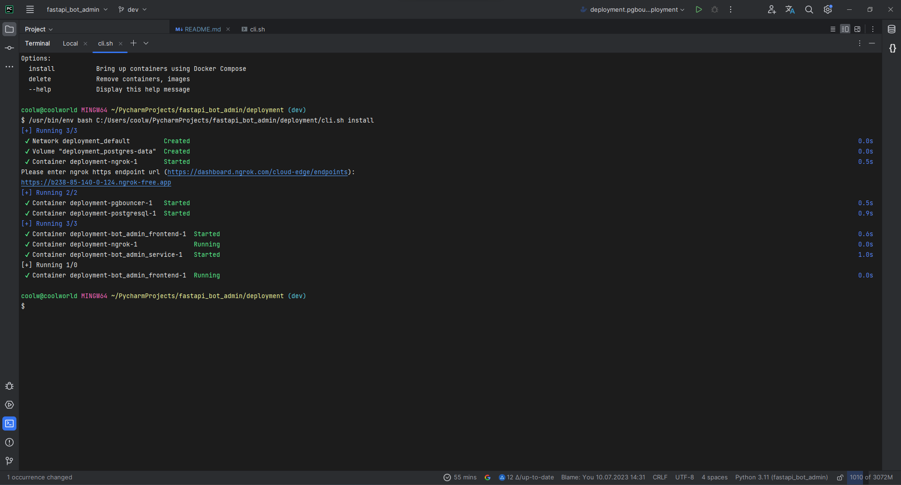
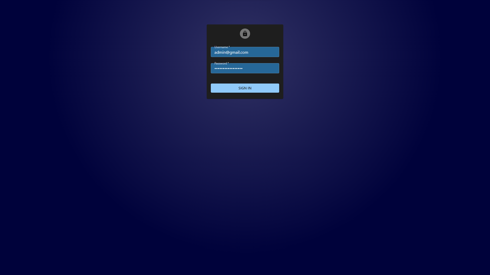
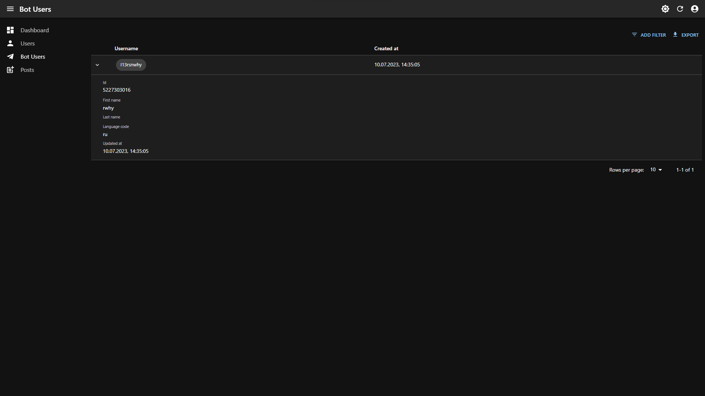
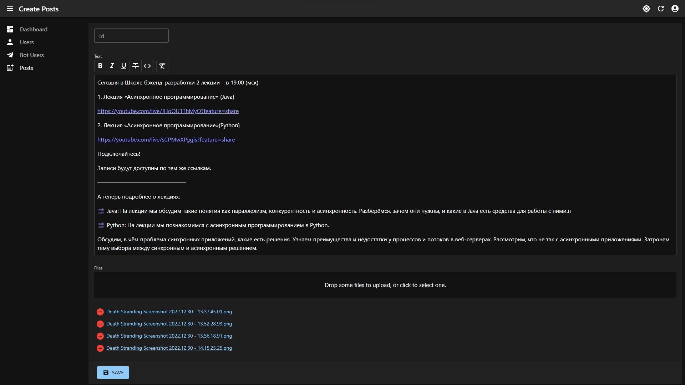
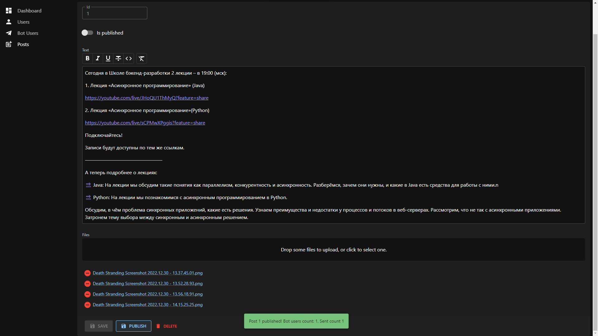
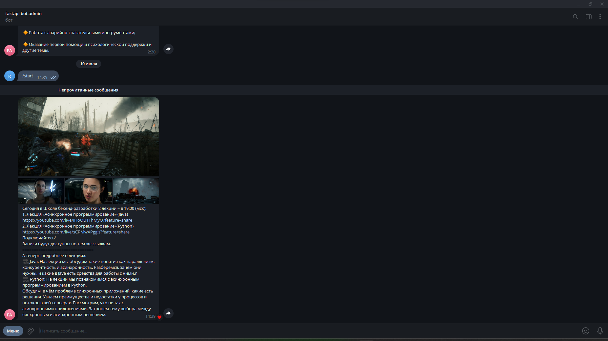
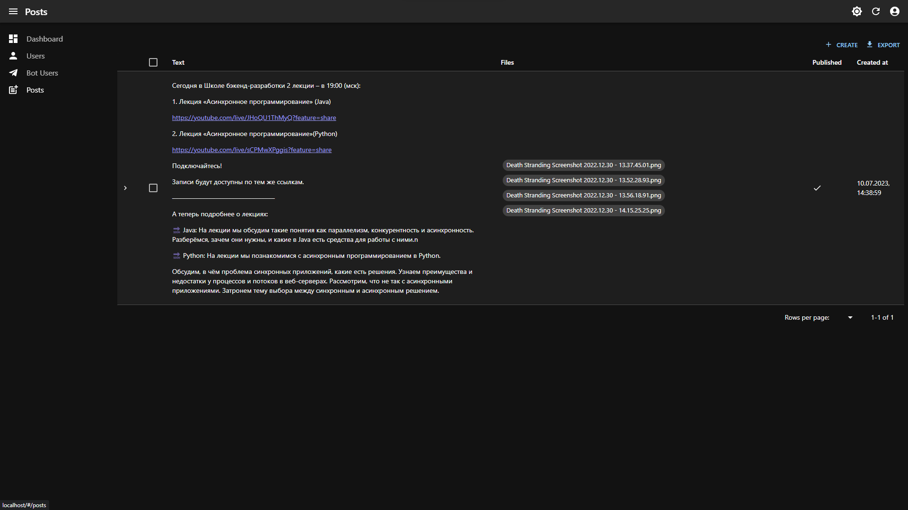
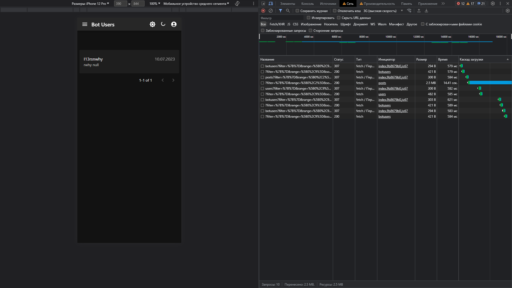

# Telegram bot admin panel

<div>


</div>

---



















---

## Deployment

```text
git clone https://github.com/coolworld2049/<project_name>.git
```

```text
cd src/<project_name>;
cp .env.example .env;
nano .env
```

```text
cd deployment
bash cli.sh install
```

deployment/cli.sh

  ```text
  Usage: cli.sh [OPTION]
  Options:
    install           Bring up containers using Docker Compose
    delete            Remove containers, images
    --help            Display this help message
  
  ```